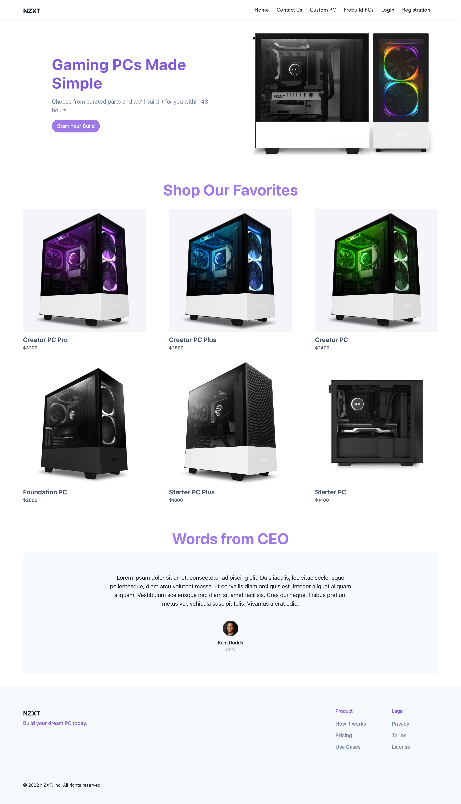
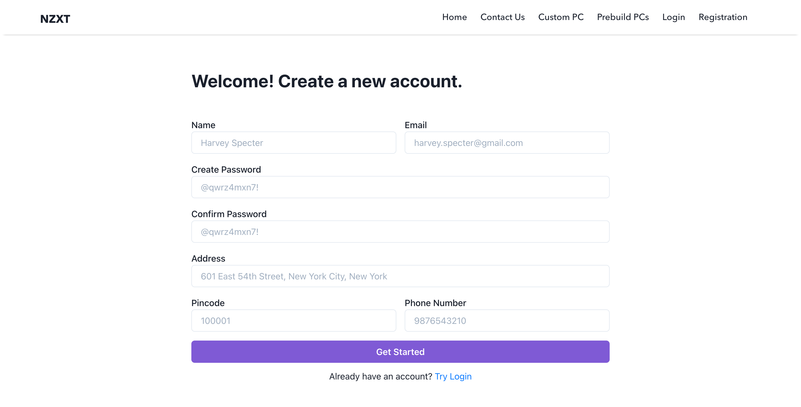
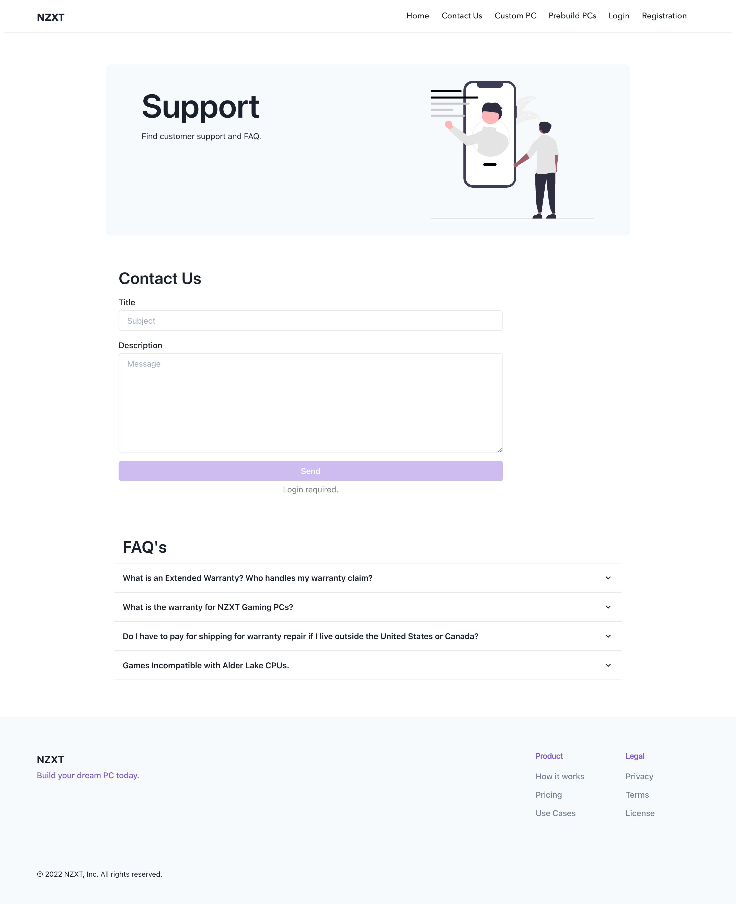
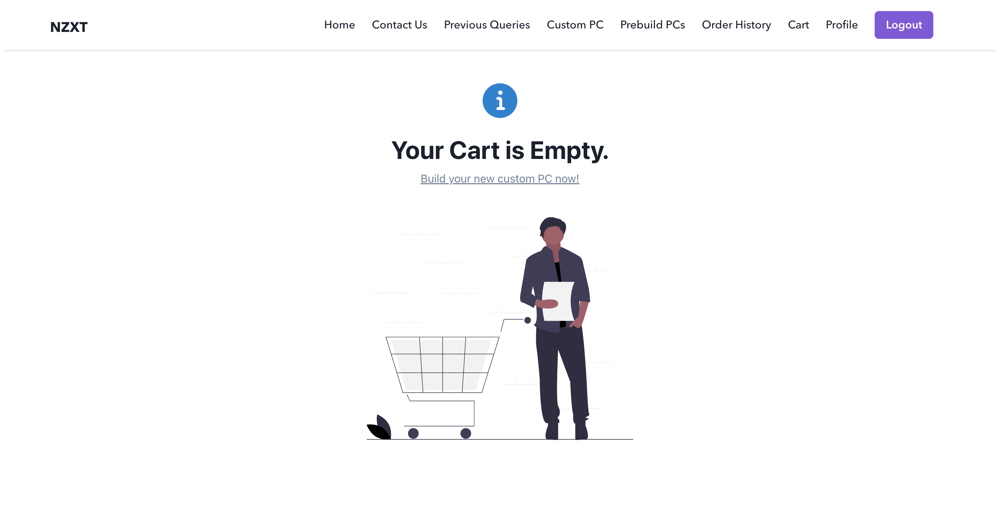

## PC-Builder-Web

1. cd pc-builder-web
2. Install all the packages using `npm i`
3. Setup .env file
4. Make sure the pc-builder-api is running
5. Run the server using `npm start`

### Computer Engineering (SEM-IV) WP Mini-Project

### Tech Used:

Frontend

1. React
2. Formik Yup
3. Axios

Backend

1. ExpressJS
2. Typescript
3. TypeORM
4. PostgreSQL
5. Redis

### Sample Images

Landing Page

Prebuilt Page

Register Page

Support Page

Cart Page

